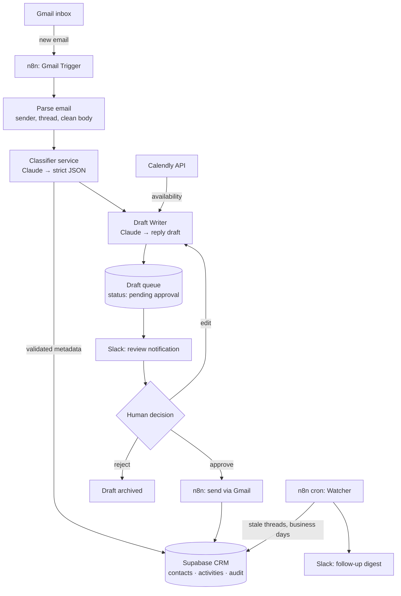
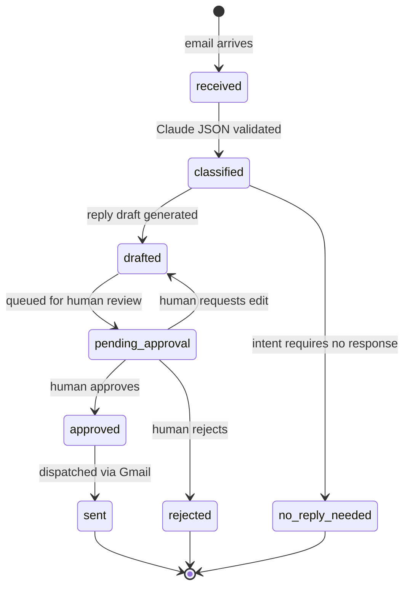

# Architecture

## System intent

Recruiting AI Automation turns a recruiting Gmail inbox into a structured, human-supervised pipeline. Every incoming email is parsed and classified by Claude into strict JSON, recorded in a Supabase CRM, and — where a reply is warranted — answered with an AI-drafted response that a human must approve before anything is sent. A scheduled Watcher surfaces conversations going stale, and Calendly availability is consulted before any meeting time is offered. The system automates the mechanical work of recruiting communication while keeping judgment with the human.

## Architecture pattern

**Modular monolith of n8n workflows + one small TypeScript service.**

- **n8n** owns everything event- and integration-shaped: the Gmail trigger, Slack delivery, Calendly lookups, cron schedules, and the approval loop. Workflows are exported as JSON into `workflows/` for version control.
- **TypeScript service(s)** (in `services/`) own everything logic-shaped: prompt construction, Claude API calls, JSON schema validation, and business-day calculations. This keeps AI logic testable, typed, and reviewable — things n8n expression nodes are poor at.
- **Supabase (Postgres)** is the single source of truth: contacts, conversations, activities, drafts, and the audit trail. Both n8n and the service read/write through it.

Rationale (decision D-001, D-002 in [DECISIONS.md](DECISIONS.md)): a solo-founder portfolio system needs the smallest number of moving parts that still demonstrates production discipline. n8n gives visual, exportable integration plumbing; a thin code layer keeps the AI core unit-testable; one Postgres database avoids state sprawl.

## Component map

| Component | Phase | Runs in | Responsibility |
|---|---|---|---|
| Gmail Trigger | II | n8n | Detect new inbound recruiting emails |
| Email Parser | II | n8n + service | Extract sender, thread, body; strip signatures/quotes |
| Classifier (Oracle) | III | service | Claude call → strict JSON: intent, candidate/role metadata, urgency, summary |
| Draft Writer | III | service | Claude call → suggested reply draft |
| CRM (Memory) | IV | Supabase | Contacts, conversations, activities, timestamps, audit trail |
| Watcher | V | n8n cron + service | Detect threads with no reply after N business days; post Slack digest |
| Clockkeeper | VI | n8n + Calendly API | Fetch availability; propose conflict-free meeting slots into drafts |
| Guardian | VII | n8n + Slack/Supabase | Approval queue; humans approve/reject/edit drafts; only approved drafts send |
| Blacksmith | VIII | cross-cutting | Retries, idempotency keys, error alerts, fallback models, structured logging |

## Data flow

## Draft lifecycle

## Guiding constraints

1. **Human in the loop is non-negotiable.** No email leaves the system without explicit approval (Phase VII gate applies from the first send onward).
2. **Strict JSON at the AI boundary.** Every Claude response is validated against a schema before it touches the database; invalid output is retried, then dead-lettered with an alert.
3. **Idempotency everywhere.** Gmail message IDs are the natural idempotency keys — reprocessing an email must never duplicate CRM rows or drafts.
4. **Audit trail.** Every state change on a draft or contact writes an activity row with actor (human/system) and timestamp.
5. **Secrets never in git.** See [SECRETS.md](SECRETS.md).

## Non-goals for Phase I

- No application code, workflows, or database migrations exist yet — Phase I is structure and documentation only.
- Detailed schema design (tables, indexes, RLS) is a Phase IV deliverable; prompt/schema design is Phase III.
- Deployment topology (n8n Cloud vs self-hosted) is an open question tracked in [CONTEXT.md](../CONTEXT.md).

## System thinking checkpoints

Questions to re-ask at every phase gate (from the Sphere Method knowledge base):

- What breaks if inbound email volume grows 10×?
- What breaks while I'm asleep? (Watcher and alerting must answer this by Phase VIII.)
- What happens when Claude, Gmail, Slack, or Calendly is down?
- Can another developer maintain this from the docs alone? (Phase IX exit test.)
