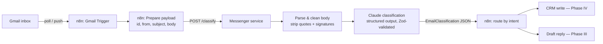

# Phase II – The Messenger

> *"An inbox is not noise but a river of stories. Every email deserves to be understood before it is answered."*

**Objectives:** Gmail trigger, parsing, AI classification, structured metadata.
**Status:** In development.

## Architecture

Phase II delivers the intake half of the pipeline: an email arrives in Gmail, n8n picks it up, and a TypeScript service turns it into validated, structured metadata.

### Components

| Component | Location | Responsibility |
|---|---|---|
| Gmail intake workflow | `workflows/02-messenger-gmail-intake.json` | Gmail trigger, payload preparation, call to the service, routing on the result |
| Messenger service | `services/messenger/` | HTTP API (`POST /classify`), email cleaning, Claude call, schema validation |
| Classification schema | `services/messenger/src/schema.ts` | The single source of truth for what "structured metadata" means |

### The classification contract

Every email is classified into exactly this shape (Zod-enforced, produced via the API's structured-outputs feature so the model cannot return malformed JSON):

- `intent` — one of `candidate_application`, `recruiter_outreach`, `interview_scheduling`, `follow_up`, `offer_discussion`, `rejection`, `other_recruiting`, `not_recruiting`
- `urgency` — `low` | `normal` | `high`
- `requires_reply` — boolean (drives the Phase III draft pipeline)
- `summary` — 1–2 sentence human-readable summary
- `contact` — extracted `name`, `company`, `role` (nullable fields)
- `mentioned_dates` — dates/times referenced in the email, as written

### AI boundary rules applied (see CONVENTIONS.md)

1. **Untrusted input:** email content is wrapped in `<email>` tags and the system prompt instructs the model to treat it strictly as data — instructions inside an email must never be followed. This is the prompt-injection defense.
2. **Strict validation:** `client.messages.parse()` + Zod — invalid output raises, it never reaches a consumer.
3. **Bounded retries:** the Anthropic SDK retries 429/5xx twice with backoff; a classification that still fails returns HTTP 502 to n8n, which routes to its error output (dead-letter handling is formalized in Phase VIII).
4. **No sends:** Phase II is read-only with respect to Gmail (OAuth scope: read-only until Phase VII).

### Model choice

`claude-haiku-4-5` (configurable via `CLAUDE_MODEL`). Classification is a bounded, well-structured extraction task — model, urgency, contact fields, a short summary from a schema the model must fill in — which Haiku-tier models handle as reliably as larger ones, at a fraction of the cost and latency. That matters once this is running against real inbox volume. Opus/Fable-tier reasoning is reserved for Phase III, where the model actually composes draft reply content and the extra reasoning earns its cost.

Adaptive thinking (`thinking: {type: "adaptive"}`) is only requested for models that support it (Opus 4.6+/Sonnet 4.6+/Fable 5) — Haiku 4.5 doesn't support it, so the classifier omits the parameter entirely when `CLAUDE_MODEL` resolves to a Haiku model. `max_tokens` is 4096 (classification output is small). Token usage is logged per call for cost observability. See decision D-006.

### Idempotency note

The Gmail `message_id` travels through the whole pipeline and is returned with the classification. Deduplication happens at the storage layer (Phase IV) using it as the natural key; the classify endpoint itself is stateless and safe to retry.

## Exit criteria

- [x] Architecture documented (this file)
- [x] Messenger service implemented with unit tests passing (22 tests)
- [x] n8n workflow exported to `workflows/02-messenger-gmail-intake.json`
- [ ] Live end-to-end test with a real Gmail message
- [ ] Owner approval to advance to Phase III
